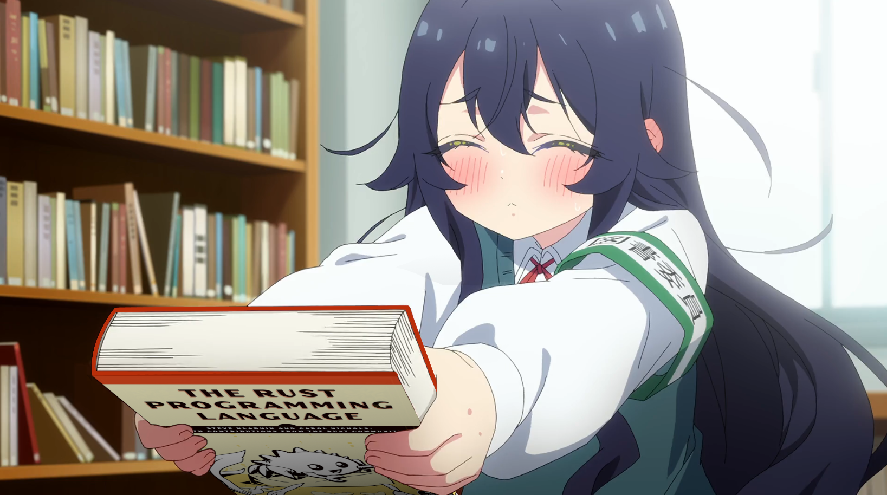

  

# CALION

`linux` · `rust` · `c` · `cpp` · `python`

# CALION

### linux • rust • c/c++ • python

---

## about

student & open source enthusiast.

i like Linux, systems programming, developer tools
and building things just to understand how they work.

> 🦀 Rust is my favorite.

---

## stack

**languages**

`Rust` `C` `C++` `Python`

**tools**

`Linux` `Git` `Docker` `VS Code`

**interests**

`Systems` `Open Source` `CLI` `Linux` `GameDev`

---

## currently

🦀 learning Rust  
🐧 exploring Linux  
⚙️ studying C/C++  
🐍 building with Python  
◆ learning open source

---

### 「 build • break • learn 」

